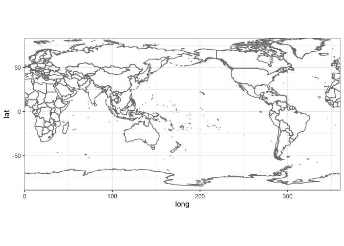
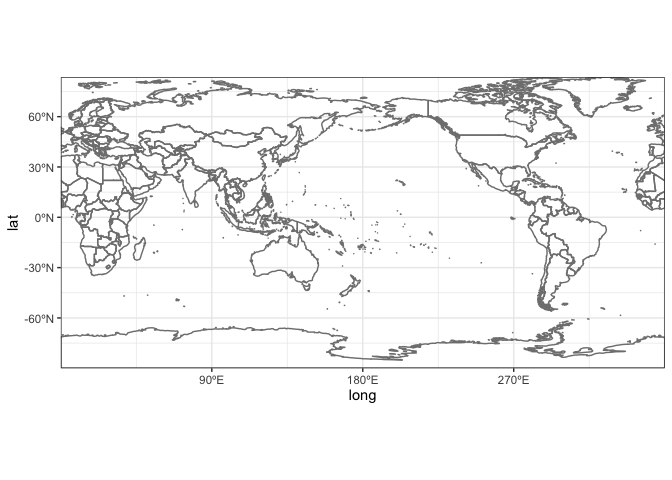

<!-- CURRICULUM_HEADER_START -->
<div class="mh"><p class="mh-crumb"><a href="/series/earth-data/index.html">Earth Data in Python and R</a><span class="sep">·</span>Part 6 · Maps</p><p class="mh-facts"><span class="lvl lvl-introductory">Introductory</span></p><p class="mh-assumes">Some programming in any language.</p></div>
<!-- CURRICULUM_HEADER_END -->

::: {.callout-note appearance="simple" icon=false}
## TL;DR

`borders("world")` in ggplot2 runs from -180° to 180° and splits the map at the antimeridian. `borders("world2")` uses a 0° to 360° longitude range, moving the seam to Greenwich without tearing any polygon, and `scales::label_number` turns the axis breaks into degree labels. Two lines give a base map to draw on.
:::

## Why the seam matters

Every flat world map has a seam: one meridian where the globe is cut open and the two edges become the left and right borders of the page. The `world` database behind `borders("world")` stores longitudes from -180° to 180°, so its seam sits at the antimeridian in the middle of the Pacific. Greenwich is in the centre, the Americas on the left, Asia on the right. That layout is the right one for anything spanning the Atlantic and the wrong one for anything spanning the Pacific: a typhoon track from the Philippines to Hawaii, dust carried from the Gobi to North America, or a sea-surface temperature anomaly along the equator all run into the page edge and continue on the other side.

The tempting fix is to shift the longitudes yourself with `lon %% 360`, which maps -179° to 181° and leaves 0° to 180° unchanged. On point data this works. On polygons it does not. A country that straddles the Greenwich meridian, such as the United Kingdom, France, Spain or Ghana, ends up with vertices near 359° and near 1°, and `geom_polygon` joins them with a straight line across the whole map. The polygons need to be cut at the new seam, not just relabelled.

The `maps` package ships that pre-cut version as `world2`: the same coastlines, stored on 0° to 360° with every polygon closed on one side of the Greenwich seam. Nothing tears, and the two lines below are the whole recipe.

## Shifting the seam with world2

`borders("world2")` draws the same coastlines as `borders("world")` but on a 0° to 360° longitude range, so the seam moves from the antimeridian to the Greenwich meridian and the polygons that cross 180° stay whole. `coord_fixed(expand = FALSE)` keeps a degree of longitude and a degree of latitude the same length on the page and removes the default padding around the panel.

```r
library(ggplot2) # for plotting

ggplot() + borders("world2") + coord_fixed(expand = FALSE) + theme_bw()
```



The axes read better with degree labels.

```r
library(scales)  # for formatting axes labels

ggplot() + borders("world2") + coord_fixed(expand = FALSE) + theme_bw() +
  scale_x_continuous(breaks = c(90, 180, 270), labels = label_number(suffix = "ºE")) +
  scale_y_continuous(breaks = c(-60, -30, 0, 30, 60), labels = label_number(suffix = "ºN"))
```



`label_number(suffix = "ºE")` appends the suffix to whatever number the break holds, so 270 is labelled 270ºE rather than 90ºW. If you want conventional labels, pass a function instead: `labels = function(x) ifelse(x > 180, paste0(360 - x, "ºW"), paste0(x, "ºE"))`. The breaks stay where they are; only the text changes.

## Putting data on the shifted map

The base map is only the background. Anything drawn on top has to use the same longitude convention, so convert your data once before plotting: `df$lon <- df$lon %% 360`. Points need nothing else. For gridded fields, shift the longitude coordinate and then re-sort the columns so the grid is monotone in longitude; `geom_raster` and `geom_tile` assume a regular, ordered grid and draw nothing sensible across a wraparound. Lines and paths need a moment of thought, because the seam has not disappeared, it has moved. A trajectory that crosses Greenwich will now be drawn as a horizontal streak across the map, exactly the artefact that `world2` avoided for the coastlines. Choose the seam where your data is not. `borders()` also accepts the `fill` and `colour` arguments of `geom_polygon`, so a light grey land mass behind a raster is one extra argument rather than another layer.

For a seam anywhere else, `maps::map` accepts a `wrap` argument with two longitudes giving the range to draw, and `ggplot2::map_data` passes extra arguments through to it, so `map_data("world", wrap = c(-30, 330))` returns polygons cut at 30°W and centred on 150°E. Plot the result with `geom_polygon(aes(long, lat, group = group))`; the `group` column is what keeps islands and enclaves as separate rings. The same idea exists in the `sf` world as `sf::st_shift_longitude()`, which recentres any simple-features layer onto 0° to 360° for use with `coord_sf`.

| Approach | Longitude range | Seam | When to use |
| :--- | :--- | :--- | :--- |
| `borders("world")` | -180° to 180° | Antimeridian | Atlantic or single-hemisphere subjects |
| `borders("world2")` | 0° to 360° | Greenwich | Pacific or trans-Pacific subjects |
| `map_data("world", wrap = c(a, a + 360))` | Chosen | Chosen | Any other centre, still with `geom_polygon` |
| `sf::st_shift_longitude()` | 0° to 360° | Greenwich | Layers already held as `sf` objects |

Whichever route you take, check the map once at full size before adding data. A stray horizontal line at the top or bottom of the panel means one polygon still crosses the seam, and the fix is to change the seam rather than to hide the line.

## Key takeaways

- `borders("world")` uses longitudes from -180° to 180°, so the seam falls at the antimeridian; `borders("world2")` uses 0° to 360° and moves the seam to Greenwich.
- `world2` is a separately built polygon set, so no country is cut at the new seam.
- Anything plotted on top must use the same 0° to 360° convention; convert negative longitudes with `lon %% 360`.
- `scales::label_number(suffix = "ºE")` turns numeric breaks into degree labels without changing the data.
- `coord_fixed(expand = FALSE)` keeps one degree of longitude equal to one degree of latitude and removes the padding around the map.

<!-- CURRICULUM_FOOTER_START -->
<div class="mf"><a class="mf-prev" href="/blogs/pm25/plot_pm25_usa_by_county.html"><span>Previous</span>Mapping PM2.5 by county</a><a class="mf-up" href="/series/earth-data/index.html"><span>Series</span>Earth Data in Python and R</a><a class="mf-next" href="/blogs/barchart-with-labels/index.html"><span>Next</span>Direct labels on bar charts</a></div>
<!-- CURRICULUM_FOOTER_END -->

