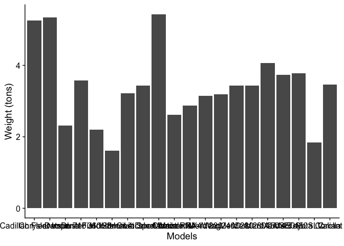
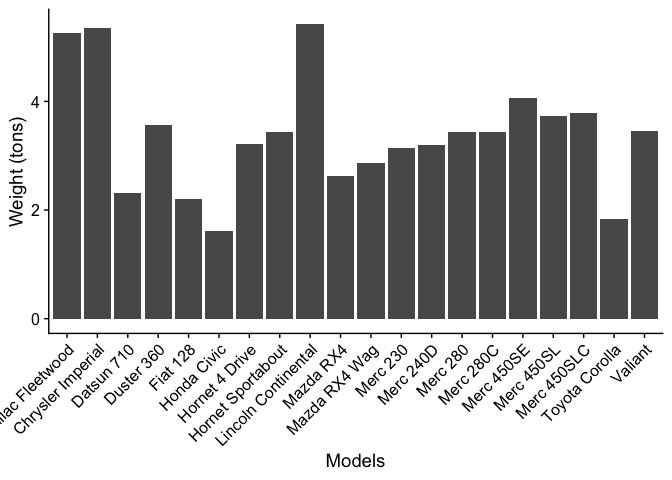
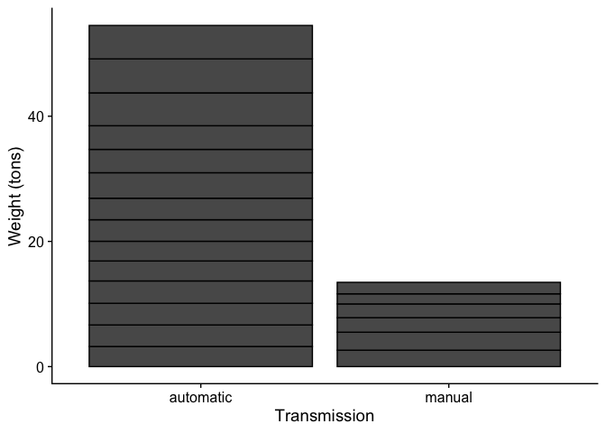
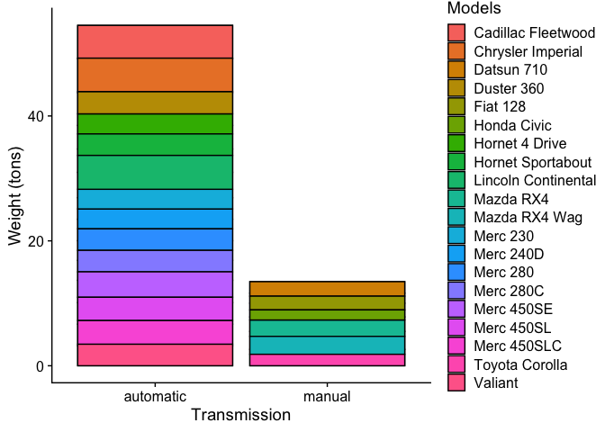
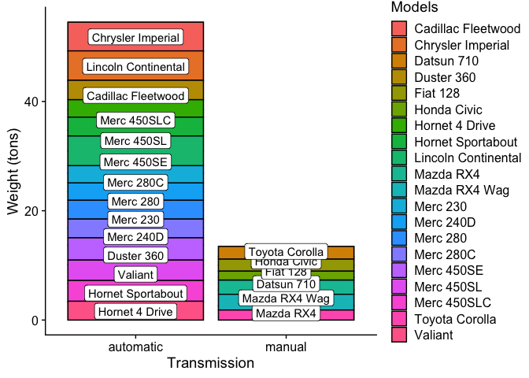
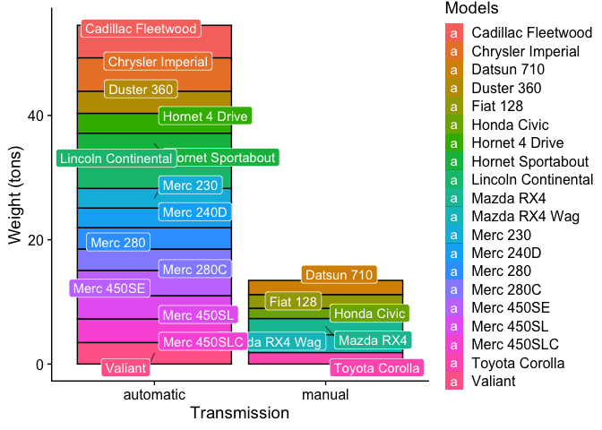
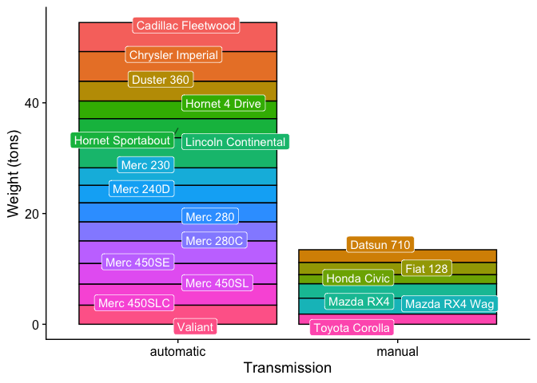

<!-- CURRICULUM_HEADER_START -->
<div class="mh"><p class="mh-crumb"><a href="/series/earth-data/index.html">Earth Data in Python and R</a><span class="sep">·</span>Part 7 · ggplot2</p><p class="mh-facts"><span class="lvl lvl-introductory">Introductory</span></p><p class="mh-assumes">Some programming in any language.</p></div>
<!-- CURRICULUM_HEADER_END -->

::: {.callout-note appearance="simple" icon=false}
## TL;DR

A stacked bar chart with a colour legend makes the reader match colour to key for every value. Putting the label on the bar removes that lookup, but `geom_label` only stacks correctly when `fill` is set in `ggplot()` rather than inside `geom_bar`. This module shows the scoping bug, the fix, and `ggrepel::geom_label_repel` for labels that no longer overlap.
:::

```{mermaid}
flowchart TD
    Data["Data Input<br/>mtcars (20 models)"] --> Base["Global Aesthetic Binding<br/>ggplot(df, aes(x=am, y=wt, fill=model))"]
    Base --> GeomBar["Stacked Bar Geometry<br/>geom_bar(stat='identity', position='stack')"]
    Base --> Scope{"Aesthetic Scope Check"}
    Scope -- "Local fill in geom_bar only" --> Fail["Grouping Mismatch Error<br/>Labels decoupled from bar stacks"]
    Scope -- "Global fill in ggplot()" --> Match["Proper Group Partitioning<br/>Labels share bar coordinates"]
    Match --> Repel["Force-Directed Repulsion<br/>ggrepel::geom_label_repel()"]
    Repel --> NoLegend["Legend Decommissioning<br/>scale_fill_discrete(guide=guide_none())"]
    NoLegend --> Final["Clean Publication Visual<br/>Zero saccade translation penalty"]

    class Data indigo
    class Base plum
    class GeomBar sage
    class Scope ochre
    class Fail rust
    class Match olive
    class Repel sienna
    class NoLegend terracotta
    class Final umber
    classDef indigo fill:#1d4a62,stroke:#c97d62,stroke-width:1.5px,color:#ffffff
    classDef umber fill:#3b1a18,stroke:#c97d62,stroke-width:1.5px,color:#ffffff
    classDef sienna fill:#6c2b27,stroke:#c97d62,stroke-width:1.5px,color:#ffffff
    classDef plum fill:#48304a,stroke:#c97d62,stroke-width:1.5px,color:#ffffff
    classDef rust fill:#a04b2d,stroke:#c97d62,stroke-width:1.5px,color:#ffffff
    classDef olive fill:#5b6e34,stroke:#c97d62,stroke-width:1.5px,color:#ffffff
    classDef ochre fill:#d69a2e,stroke:#3b1a18,stroke-width:1.5px,color:#3b1a18
    classDef terracotta fill:#c97d62,stroke:#3b1a18,stroke-width:1.5px,color:#3b1a18
    classDef sage fill:#95a87f,stroke:#3b1a18,stroke-width:1.5px,color:#3b1a18
```

## Why legends cost the reader

According to the graphical perception hierarchy established by Cleveland and McGill, visual encodings vary drastically in decoding speed and quantitative accuracy:

| Perception Rank | Elementary Graphical Task | Visual Encoding Mechanism | Cognitive Translation Cost |
| :--- | :--- | :--- | :--- |
| **Tier 1 (Optimal)** | Position along a common scale | Aligned bar height / coordinate axes | Lowest (direct pre-attentive registration) |
| **Tier 2 (High)** | Direct inline annotation / Badges | Value labels mapped adjacent to data marks | Minimal (zero saccadic search required) |
| **Tier 3 (Moderate)** | Length / Area | Segment height within stacked bars | Moderate (requires mental zero-baseline shifting) |
| **Tier 4 (Poor)** | Color hue matching via legends | Isolated legend keys cross-referenced with marks | Highest (severe eye-saccade search penalty) |

When stacked bar charts exceed 5–7 categorical factors, legend lookup forces the reader into continuous eye-saccade cycling. Direct in-situ data labeling with `geom_label` eliminates the legend entirely.

## Aesthetic scope inheritance

In `ggplot2`, stacking calculations (`position_stack()`) rely strictly on the grouping structure of the layer.

### The scope inheritance bug

When the fill aesthetic is defined locally inside `geom_bar` rather than globally in `ggplot()`:

```r
# INCORRECT: Inconsistent aesthetic scoping
ggplot(df, aes(x = am, y = wt)) +
  geom_bar(aes(fill = model), stat = "identity", position = "stack") +
  geom_label(aes(label = model), position = position_stack(vjust = 0.5))
```

1. `geom_bar` partitions the data by `model` and calculates stacked vertical offsets.
2. `geom_label` does **not** inherit the `fill` aesthetic, causing it to treat the entire vertical column as a single un-partitioned group.
3. The resulting labels collapse to the center coordinate of the total stack, misidentifying the data slices.

### The correct pipeline contract

Binding `fill = model` in the root `ggplot()` call enforces a unified data contract across all child geometric layers:

```r
# CORRECT: Unified global grouping across geoms
ggplot(df, aes(x = am, y = wt, fill = model)) +
  geom_bar(stat = "identity", position = "stack") +
  geom_label_repel(aes(label = model), position = position_stack(vjust = 0.5))
```

## Step-by-step implementation

### Phase 1: Baseline chart and axis clutter

```r
library(ggplot2)
library(cowplot)
library(ggrepel)

# Sample dataset: 20 vehicle models from mtcars
df <- mtcars[1:20, ]
```

```r
# Baseline un-rotated bar chart
g_base <- ggplot(data = df, mapping = aes(x = rownames(df), y = wt)) +
  geom_bar(stat = "identity", fill = "#334155") +
  theme_cowplot() +
  labs(x = "Vehicle Model", y = "Weight (tons)")

g_base
```



Rotating x-axis text by $45^\circ$ mitigates string collisions:

```r
g_rotated <- g_base + theme(axis.text.x = element_text(angle = 45, hjust = 1))
g_rotated
```



### Phase 2: Category aggregation and stacked bars

Aggregating by transmission type (`am: 0 = automatic, 1 = manual`):

```r
df$am <- factor(df$am, labels = c("Automatic", "Manual"))

g_stack <- ggplot(data = df, mapping = aes(x = am, y = wt)) +
  geom_bar(stat = "identity", position = "stack", color = "black", fill = "#475569") +
  theme_cowplot() +
  labs(x = "Transmission Type", y = "Total Weight (tons)")

g_stack
```



Assigning discrete fills by model introduces the visual legend bottleneck:

```r
g_colored <- g_stack +
  geom_bar(mapping = aes(fill = row.names(df)), stat = "identity", position = "stack", color = "black") +
  labs(fill = "Models")

g_colored
```



### Phase 3: Scope resolution and label repulsion

Adding naive un-scoped labels produces coordinate mismatch and text overlap:

```r
# Demonstrating naive label collision
g_mismatch <- g_colored +
  geom_label(mapping = aes(label = row.names(df)), position = position_stack(vjust = 0.5))

g_mismatch
```



Resolving aesthetic scoping globally and applying `ggrepel::geom_label_repel`:

```r
g_repel <- ggplot(data = df, mapping = aes(x = am, y = wt, fill = row.names(df))) +
  geom_bar(stat = "identity", position = "stack", color = "black") +
  geom_label_repel(
    mapping = aes(label = row.names(df)),
    position = position_stack(vjust = 0.5),
    color = "white",
    segment.alpha = 0.6,
    segment.color = "black",
    box.padding = 0.25,
    show.legend = FALSE
  ) +
  theme_cowplot() +
  labs(x = "Transmission Type", y = "Total Weight (tons)", fill = "Models")

g_repel
```



Decommissioning the redundant legend entirely:

```r
g_final <- g_repel + scale_fill_discrete(guide = guide_none())
g_final
```



### Production R pipeline module

::: {.callout-note collapse="true"}
## View Modular Production Code (`create_direct_labeled_barchart.R`)

```r
#' Generate Publication-Grade Stacked Bar Chart with Direct Repelled Badges
#'
#' @param data Input dataframe.
#' @param x_var Bare column name for categorical x-axis grouping.
#' @param y_var Bare column name for quantitative numeric values.
#' @param stack_var Bare column name for sub-group stacking and label text.
#' @param x_label String for x-axis title.
#' @param y_label String for y-axis title.
#' @return ggplot object with direct badge labels and no redundant legend.
plot_direct_labeled_stack <- function(data, x_var, y_var, stack_var,
                                      x_label = "Category",
                                      y_label = "Value") {
  require(ggplot2)
  require(ggrepel)
  require(cowplot)

  x_enquo <- rlang::enquo(x_var)
  y_enquo <- rlang::enquo(y_var)
  stack_enquo <- rlang::enquo(stack_var)

  p <- ggplot(data, aes(x = !!x_enquo, y = !!y_enquo, fill = factor(!!stack_enquo))) +
    geom_bar(stat = "identity", position = "stack", color = "black", width = 0.65) +
    geom_label_repel(
      aes(label = !!stack_enquo),
      position = position_stack(vjust = 0.5),
      color = "white",
      segment.alpha = 0.6,
      segment.color = "black",
      box.padding = 0.2,
      point.padding = 0.1,
      size = 3.2,
      show.legend = FALSE
    ) +
    scale_fill_discrete(guide = guide_none()) +
    theme_cowplot() +
    theme(
      axis.title = element_text(size = 11, face = "bold"),
      axis.text = element_text(size = 10)
    ) +
    labs(x = x_label, y = y_label)

  return(p)
}
```
:::

### Data and code availability

- **Dependencies**: R $\ge 4.0.0$, `ggplot2`, `cowplot`, `ggrepel`, `reshape2`.
- **Dataset**: Motor Trend Car Road Tests dataset (`mtcars`, standard R base package).

## Key takeaways

- A legend forces the reader to match colour to key for every bar; a label on the bar removes that step.
- `position_stack` groups by the aesthetics in scope; if `fill` lives only inside `geom_bar`, `geom_label` sees one group and puts every label at the column midpoint.
- Set `fill` in `ggplot()` so every layer shares the grouping, and the labels stack with the bars.
- `ggrepel::geom_label_repel` with `position_stack(vjust = 0.5)` keeps labels inside the stack and pushes overlapping ones apart.
- Once the bars carry their labels, drop the legend with `scale_fill_discrete(guide = guide_none())`.

<!-- CURRICULUM_FOOTER_START -->
<div class="mf"><a class="mf-prev" href="/blogs/atlantic-centered-map/index.html"><span>Previous</span>An Atlantic-centred map</a><a class="mf-up" href="/series/earth-data/index.html"><span>Series</span>Earth Data in Python and R</a><a class="mf-next" href="/blogs/setting-color-bars/index.html"><span>Next</span>Colorbars</a></div>
<!-- CURRICULUM_FOOTER_END -->

