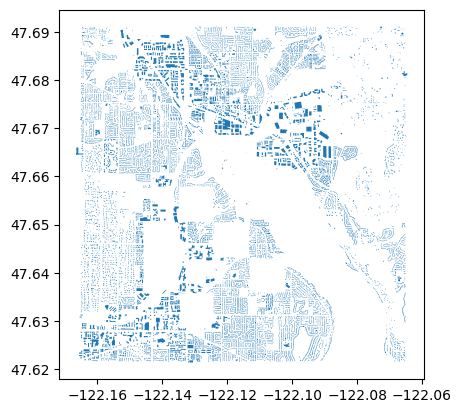

<!-- CURRICULUM_HEADER_START -->
<div class="mh"><p class="mh-crumb"><a href="/series/earth-data/index.html">Earth Data in Python and R</a><span class="sep">·</span>Part 5 · Vector data</p><p class="mh-facts"><span class="lvl lvl-intermediate">Intermediate</span></p><p class="mh-assumes">Assumes <span class="unwritten" title="not written yet">GeoPandas basics</span>.</p></div>
<!-- CURRICULUM_HEADER_END -->

::: {.callout-note appearance="simple" icon=false}
## TL;DR

Microsoft's Global ML Building Footprints is distributed as zoom-9 quadkey tiles of line-delimited GeoJSON, far larger than most areas of interest. This module finds the tiles that cover a polygon with `mercantile`, downloads only those, clips the buildings to the polygon in `geopandas`, and writes GeoParquet. Swap in any polygon from geojson.io and the same four steps apply.
:::

---

This notebook works with the [Microsoft Building Footprint Dataset](https://github.com/microsoft/GlobalMLBuildingFootprints) to download building footprints for a given area of interest (AOI). I modified the [original notebook](https://github.com/victor-ka-ming-fung/GlobalMLBuildingFootprints/blob/main/examples/example_building_footprints.ipynb) to download the data to output a parquet file of a GeoDataFrame of buildings, instead of GeoJSON.

To find the Jupyter notebook version, please visit [the improved notebook on GitHub](https://github.com/victor-ka-ming-fung/GlobalMLBuildingFootprints/blob/improved_example_notebook/examples/example_building_footprints.ipynb).

```python
# # """install packages if not already installed"""
# %pip install --upgrade pandas geopandas shapely mercantile tqdm folium
```

## Setup and area of interest

```python
import pandas as pd
import geopandas as gpd
import shapely.geometry
import mercantile
from tqdm import tqdm

output_fn = "example_building_footprints.parquet"
```

### Define the area of interest

We define our area of interest (or AOI) as a GeoJSON geometry, then use the `shapely` library to get the bounding box.

**Note**: the coordinate reference system for the GeoJSON should be "EPSG:4326", i.e. in global lat/lon format.

```python
# Geometry copied from https://geojson.io
aoi_geom = {
    "coordinates": [
        [
            [-122.16484503187519, 47.69090474454916],
            [-122.16484503187519, 47.6217555345674],
            [-122.06529607517405, 47.6217555345674],
            [-122.06529607517405, 47.69090474454916],
            [-122.16484503187519, 47.69090474454916],
        ]
    ],
    "type": "Polygon",
}
aoi_shape = shapely.geometry.shape(aoi_geom)
minx, miny, maxx, maxy = aoi_shape.bounds


```

## Tiles and download

### Find the tiles that intersect the AOI

```python
"""Get tiles for a given bounding box and zoom level"""

quad_keys = set()
for tile in list(mercantile.tiles(minx, miny, maxx, maxy, zooms=9)):
    quad_keys.add(int(mercantile.quadkey(tile)))

quad_keys = list(quad_keys)

print(f"The input area spans {len(quad_keys)} tiles: {quad_keys}")
```

    The input area spans 1 tiles: [21230030]

### Download each tile and crop to the AOI

We download all the building footprints for each tile that intersects our AOI, then only keep the footprints that are _contained_ by our AOI.

_Note_: this step might take awhile depending on how many tiles your AOI covers and how many buildings footprints are in those tiles.

```python
# read the quads catalog
df = pd.read_csv(
    "https://minedbuildings.blob.core.windows.net/global-buildings/dataset-links.csv"
)

# extract urls for the quads we want
urls = df.pipe(lambda x: x[x["QuadKey"].isin(quad_keys)])["Url"].unique()

# download the quads and read as one consolidated pandas dataframe
buildings_df_list = [pd.read_json(url, lines=True) for url in tqdm(urls)]

# concatenate the list of dataframes
buildings_df = pd.concat(buildings_df_list)

# concvert to geopandas dataframe
buildings_gdf = (
    buildings_df.pipe(
        lambda x: gpd.GeoDataFrame(
            data=x,
            crs=4326,
            geometry=x["geometry"].apply(shapely.geometry.shape),
        )
    )
    # retain the height information
    .assign(
        height_m=lambda x: x["properties"].apply(
            lambda p: p["height"],
        ),
    )
    # drop the raw column for height and type
    .drop(
        columns=[
            "properties",
            "type",
        ],
        errors="ignore",
    )
)
```

      0%|          | 0/1 [00:00<?, ?it/s]

```python
# filter to buildings that intersect the AOI
buildings_in_aoi_gdf = buildings_gdf[buildings_gdf.intersects(aoi_shape)]
```

## Saving and checking the result

### Write GeoParquet

```python
# write to parquet
buildings_in_aoi_gdf.to_parquet(output_fn)
```

### Optional sense check

```python
# interactive map
# import folium

# m = buildings_in_aoi_gdf.explore(
#     attr="Google",
#     tiles="https://mt1.google.com/vt/lyrs=s&x={x}&y={y}&z={z}",
# )

# folium.TileLayer("OpenStreetMap").add_to(m)

# folium.LayerControl().add_to(m)

# m
```

```python
# static map
buildings_in_aoi_gdf.plot()
```



## Key takeaways

- The dataset is tiled by zoom-9 quadkey; `mercantile.tiles` on the AOI bounding box gives the keys, and the catalogue CSV maps each key to a download URL.
- Each tile is line-delimited GeoJSON, so `pd.read_json(url, lines=True)` streams it into a DataFrame and `shapely.geometry.shape` converts each geometry.
- Filter with `intersects(aoi_shape)` after loading; a tile is usually much larger than the AOI.
- `to_parquet` writes GeoParquet, which is smaller and faster to read back than GeoJSON and keeps the CRS.
- Check the result with `.plot()` or `.explore()` before using it downstream.

<!-- CURRICULUM_FOOTER_START -->
<div class="mf"><a class="mf-prev" href="/blogs/regional-analysis-r/index.html"><span>Previous</span>Regional analysis in R</a><a class="mf-up" href="/series/earth-data/index.html"><span>Series</span>Earth Data in Python and R</a><a class="mf-next" href="/blogs/pm25/plot_pm25_usa_by_county.html"><span>Next</span>Mapping PM2.5 by county</a></div>
<!-- CURRICULUM_FOOTER_END -->

