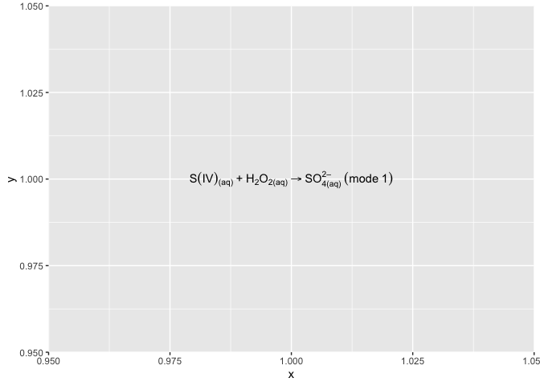

<!-- CURRICULUM_HEADER_START -->
<div class="mh"><p class="mh-crumb"><a href="/series/earth-data/index.html">Earth Data in Python and R</a><span class="sep">·</span>Part 7 · ggplot2</p><p class="mh-facts"><span class="lvl lvl-introductory">Introductory</span></p><p class="mh-assumes">Some programming in any language.</p></div>
<!-- CURRICULUM_HEADER_END -->

::: {.callout-note appearance="simple" icon=false}
## TL;DR

A chemical reaction typed as a plain string into a ggplot2 label renders as literal characters. With `parse = TRUE` the label goes through R's `plotmath`, where `[ ]` gives subscripts, `^` superscripts, `~` and `*` control spacing, and `%->%` draws the arrow. This module dissects one reaction label symbol by symbol.
:::

## A reaction as a plot label

The example places a chemical reaction in a plot created by ggplot2. It looks straightforward; the way R handles it is not. A label string is normally drawn character for character, so `SO4^2-` appears exactly as typed, with no subscript and no superscript. To get typeset output the string has to be handed to R's `plotmath` system, which reads it as an R expression and lays it out with the rules below.

```r
library(ggplot2)  # for plotting

# setting up the base plot
g = ggplot()
g = g + geom_text(aes(x = 1, y = 1, label = 'S(IV)["(aq)"]~"+"~H[2]*O[2*"(aq)"] %->% SO[4*"(aq)"]^"2–"~(mode~1)'), parse = T)

g
```



In the code example, we try to pass a string defined for "label" into
the "R" basic function "parse" to convert plain text into an "plot.math"
object, i.e., a chemical equation in this example. There are some
strange symbols in the string and they all carry special function -

- round brackets "(" and ")" are quoted so that "parse" considers them
  normal characters.

- "~" and "\*" indicate whether linking characters are separated by a
  space or not, respectively.

- "~" can sometimes be replaced by a space character " " if there is
  no ambiguity for "parse".

- "[" and "]" are used to put the containing characters as a subscript.
- "^" is used for super-scripting, and, to put multiple characters
  into one superscription, we need to quote the characters using
  quotation marks """.

- For an expression with both sub- and superscription, "parse"
  considers them orderly as sub- \> superscription.

- Finally, "%->%" is the arrow symbol, and a list of such special
  equation symbols can be found in [this website of
  plotmath](https://astrostatistics.psu.edu/su07/R/html/grDevices/html/plotmath.html).

## The plotmath operators

`plotmath` is not a markup language. The string is parsed as R code, so everything in it must be a valid R token: a name, a number, a quoted string, or an operator joining them. That single fact explains most of the errors people hit. `2H` fails because a number followed by a letter is not a token; `2*H` works. `(aq)` fails because R tries to evaluate the call; `"(aq)"` works because a quoted string is drawn literally. A stray unbalanced quote or bracket fails with a parse error before anything is drawn.

| Operator or function | Renders as | Example |
| :--- | :--- | :--- |
| `x[i]` | Subscript | `H[2]*O` |
| `x^2` | Superscript | `SO[4]^"2-"` |
| `x*y` | Juxtaposed, no space | `H[2]*O[2]` |
| `x~y` | Juxtaposed with a space | `mode~1` |
| `%->%`, `%<->%`, `%<-%` | Reaction and equilibrium arrows | `A %->% B` |
| `%+-%`, `%~~%`, `%=~%` | Plus-minus, approximately equal, congruent | `x %+-% 2` |
| `alpha`, `beta`, `mu`, `Delta` | Greek letters | `mu*g~m^-3` |
| `degree` | Degree sign | `Temperature~(degree*C)` |
| `sqrt(x)`, `frac(a, b)` | Square root, stacked fraction | `frac(d*y, d*x)` |
| `bar(x)`, `hat(x)`, `dot(x)` | Overbar, hat, dot | `bar(x)` |
| `italic(x)`, `bold(x)`, `plain(x)` | Font changes | `italic(p)` |
| `paste(a, b)`, `list(a, b)` | Concatenation, comma-separated list | `list(a, b, c)` |

Two habits save time. Write the subscript before the superscript, so an ion is `SO[4]^"2-"` and not `SO^"2-"[4]`; `plotmath` attaches each operator to the token on its left, and the reverse order puts the charge on the wrong glyph. And quote any run of characters that contains a hyphen, a bracket or a leading digit, since each of those is an operator or an invalid token when left bare.

## Axis titles and expression()

The same syntax works anywhere ggplot2 accepts a label. For a single axis title you do not need `parse = TRUE`; pass an expression object directly: `labs(x = expression(mu*g~m^-3))` or `labs(y = expression(Temperature~(degree*C)))`. `expression()` skips the string stage entirely, which means there is no quoting to get wrong and no parse step at plot time. Units belong in the axis title rather than in the tick labels, so this is the form you will reach for most often. The `parse = TRUE` route is for `geom_text` and `geom_label`, where the labels arrive as a character column and each string is parsed separately, so every row must be a valid expression on its own or the whole layer fails.

To inject a computed value into a label, use `bquote()`: `labs(title = bquote(R^2 == .(round(r2, 2))))` evaluates the part inside `.()` and leaves the rest as typeset math. For facet strips, `labeller = label_parsed` applies the same parser to the panel names, so a facet variable holding strings like `"NO[2]"` and `"O[3]"` renders with proper subscripts.

When a label refuses to render, test it outside ggplot2 first. `parse(text = 'SO[4]^"2-"')` at the console returns the expression or the exact parse error, and `plot(1, main = parse(text = ...))` shows the typeset result in base graphics. Fix the string there, then paste it back into the plot.

## Key takeaways

- `parse = TRUE` in `geom_text` (or `labs`) sends the string through `plotmath`, so the string must be a valid R expression rather than prose.
- Quote anything `parse` would try to evaluate, such as round brackets and phase suffixes like `(aq)`.
- `[ ]` gives a subscript and `^` a superscript; write the subscript first to typeset an ion such as $\mathrm{SO_4^{2-}}$.
- `~` inserts a space and `*` joins without one; `%->%` draws the reaction arrow.
- The full symbol list is in the `plotmath` help page linked above.

<!-- CURRICULUM_FOOTER_START -->
<div class="mf"><a class="mf-prev" href="/blogs/setting-color-bars/index.html"><span>Previous</span>Colorbars</a><a class="mf-up" href="/series/earth-data/index.html"><span>Series</span>Earth Data in Python and R</a><a class="mf-next" href="/blogs/segment-shadow-python/index.html"><span>Next</span>Shadow detection with scikit-image</a></div>
<!-- CURRICULUM_FOOTER_END -->

