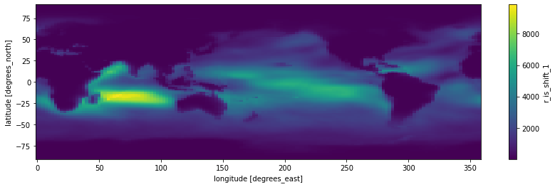
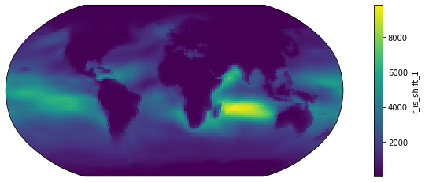
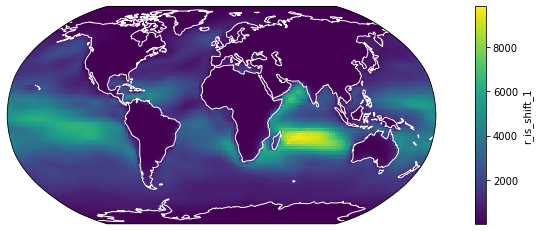
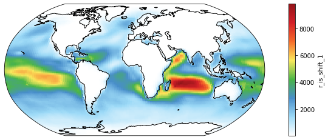
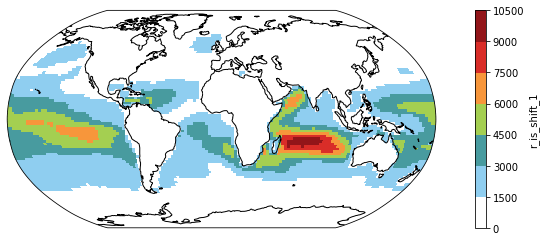
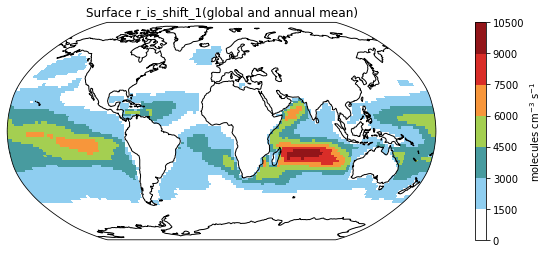
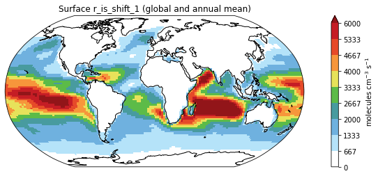

<!-- CURRICULUM_HEADER_START -->
<div class="mh"><p class="mh-crumb"><a href="/series/earth-data/index.html">Earth Data in Python and R</a><span class="sep">·</span>Part 1 · Getting started</p><p class="mh-facts"><span class="lvl lvl-introductory">Introductory</span></p><p class="mh-assumes">Some programming in any language.</p></div>
<!-- CURRICULUM_HEADER_END -->

::: {.callout-note appearance="simple" icon=false}
## TL;DR

A year of monthly CESM history files becomes one dataset with a single `xarray.open_mfdataset` call. From there you select a variable and a pressure range, average over level and time, and plot the result on a Robinson projection with `cartopy`, then add coastlines, an NCL colour scale from `cmaps`, discrete levels and a labelled colorbar before saving to PNG. Every step is one or two lines.
:::

The example combines twelve monthly CESM history files, computes annual means, and makes a map. Four references cover the same ground in more depth: the [GEOS-Chem Python tutorial](https://github.com/geoschem/GEOSChem-python-tutorial) for general handling of nc files, [PyNGL](http://www.pyngl.ucar.edu/) for NCL plot styles, [this note](https://medium.com/@neetinayak/combine-many-netcdf-files-into-a-single-file-with-python-469ba476fc14) on merging nc files, and [`cmaps`](https://github.com/hhuangwx/cmaps) for NCL colour scales.

```python
import numpy as np                    # for better array
import xarray as xr                   # the major tool to work with NetCDF data!
```

## Merging monthly .nc files

Below is a list of files for this example. They are nc files named after case name, for each month in 2016.
<br />

Note that we could use, in the code, % (magic link) to call a function on the shell level.

```python
%ls _data/*.nc
```

    _data/FC2000climo.f19_f19.2_1_MOSAIC.OAS_KPP_ISO.cam.h0.2016-01.nc
    _data/FC2000climo.f19_f19.2_1_MOSAIC.OAS_KPP_ISO.cam.h0.2016-02.nc
    _data/FC2000climo.f19_f19.2_1_MOSAIC.OAS_KPP_ISO.cam.h0.2016-03.nc
    _data/FC2000climo.f19_f19.2_1_MOSAIC.OAS_KPP_ISO.cam.h0.2016-04.nc
    _data/FC2000climo.f19_f19.2_1_MOSAIC.OAS_KPP_ISO.cam.h0.2016-05.nc
    _data/FC2000climo.f19_f19.2_1_MOSAIC.OAS_KPP_ISO.cam.h0.2016-06.nc
    _data/FC2000climo.f19_f19.2_1_MOSAIC.OAS_KPP_ISO.cam.h0.2016-07.nc
    _data/FC2000climo.f19_f19.2_1_MOSAIC.OAS_KPP_ISO.cam.h0.2016-08.nc
    _data/FC2000climo.f19_f19.2_1_MOSAIC.OAS_KPP_ISO.cam.h0.2016-09.nc
    _data/FC2000climo.f19_f19.2_1_MOSAIC.OAS_KPP_ISO.cam.h0.2016-10.nc
    _data/FC2000climo.f19_f19.2_1_MOSAIC.OAS_KPP_ISO.cam.h0.2016-11.nc
    _data/FC2000climo.f19_f19.2_1_MOSAIC.OAS_KPP_ISO.cam.h0.2016-12.nc
    _data/FC2000climo.f19_f19.2_1_MOSAIC.OAS_KPP_ISO.cam.i.2017-01-01-00000.nc

We use `xr.open_mfdataset` from xarray, specifying the paths, the **combining** method and the *dimension* for **concatenation**. Note the use of `*` as a wildcard.

```python
ds = xr.open_mfdataset(paths='_data/*.cam.h0.2016-*.nc', combine='by_coords', concat_dim="time")

# ds
```

That is the whole merge step.

## Selecting variables and checking means

We want to extract the variables concerned using some string selection tracks, for instance "startswith" here.

```python
vid = [x for x in ds.keys() if x.startswith('r_is')]
dr = ds[vid]

# dr
```

Then, we "slice" the surface layers out from the big dataset.

```python
dr_surf = dr.sel(lev=slice(100, 1000))  # lev is in hPa. Here I assume troposphere is within 1000hPa-100hPa

# dr_surf
```

Do a quick check on the global mean values.

```python
print(dr_surf.mean().compute().values)
```

    <bound method Mapping.values of <xarray.Dataset>
    Dimensions:                ()
    Data variables:
        r_is_HOOCH2SCH2O       float32 11.503614
        r_is_HOOCH2SCO_1       float32 368.33008
        r_is_HOOCH2SCO_2       float32 0.021772318
        r_is_HOOCH2SO_NO2      float32 11.119194
        r_is_HOOCH2SO_O3       float32 368.70016
        r_is_HOOCH2S_NO2       float32 10.201074
        r_is_HOOCH2S_O3        float32 369.6315
        r_is_HPMTF_OH          float32 368.35184
        r_is_OOCH2SCH2OOH_HO2  float32 12.836186
        r_is_OOCH2SCH2OOH_NO   float32 11.503614
        r_is_shift_1           float32 1240.3165
        r_is_shift_2           float32 1215.9198>

The magnitudes are plausible.

## Plotting variables on maps

To plot variables, we employ the powerful and (most) popular packages:

```python
%matplotlib inline
from matplotlib import pyplot as plt  # for plotting
```

Here, we want to plot variable, r_is_shift_1, which is a 4-D array (lon, lat, lev, and time).

```python
vid = "r_is_shift_1"                  # storing the variable id for easier recall

# dr_surf[vid]                          # just to double check if the array is what we want
```

```python
# actual plotting codes:

fig = plt.figure(figsize=(14, 4))     # defining the canvas with size 14 x 4
ax = plt.axes()                       # defining the axes (Cartesian rectangle)

dr_surf[vid].mean(dim=['lev', 'time']).plot()  # two operations happened here, this line first compute the mean along lev and time dimensions of the array and then make the plot

```

    <matplotlib.collections.QuadMesh at 0x2b0b7a6006d0>



A first map. The next five changes make it fit for a paper.

```python
# Change 1: Projection - People have been arguing about which map projection is the best to maintain the "shape" of the Earth.
# One popular choice is the Robinson
# So this is how we do it.

from cartopy import crs as ccrs       # for map projections

fig = plt.figure(figsize=(14, 4))          # again, defining the canvas
ax = plt.axes(projection=ccrs.Robinson())  # defining the axes after Robinson projection

dr_surf[vid].mean(dim=['time', 'lev']).plot(transform=ccrs.PlateCarree())  # two operations here: computing the mean, and transforming the rectangular grids onto a Robinson-projected coordinate system
```

    <matplotlib.collections.QuadMesh at 0x2b0b7a4fd310>



```python
# Change 2: Coastline - Land-sea difference of some variables are not that obvious so we also draw coastal lines for better readability

fig = plt.figure(figsize=(14, 4))
ax = plt.axes(projection=ccrs.Robinson())

dr_surf[vid].mean(dim=['time', 'lev']).plot(transform=ccrs.PlateCarree())

ax.coastlines(color="w") # this line adds coastlines to the coordinate system (aka axes in the language of matplotlib), and we used white

```

    <cartopy.mpl.feature_artist.FeatureArtist at 0x2b0b7a6d4610>



```python
# Change 3: Color Scale - the default color scale of matplotlib is a color-blindness-friendly one but some community like to use their own color scales.
# For example, this popular White-Blue-Green-Yellow-Red scale:

from matplotlib import colors as c    # for making color schemes from Ngl applicable to matplot-style plots
import cmaps                          # packages for NCL color options

fig = plt.figure(figsize=(14, 4))
ax = plt.axes(projection=ccrs.Robinson())

dr_surf[vid].mean(dim=['time', 'lev']).plot(transform=ccrs.PlateCarree(),
                                            cmap = cmaps.WhiteBlueGreenYellowRed) # assigning the color scale

ax.coastlines() # now we use black coastal lines

```

    <cartopy.mpl.feature_artist.FeatureArtist at 0x2b0b7cb88f10>



```python
# Change 4: Color Steps or discretized color scale - Some scientists advocate for minimal color shades for better comparison.
# This is how we do that.

fig = plt.figure(figsize=(14, 4))
ax = plt.axes(projection=ccrs.Robinson())

dr_surf[vid].mean(dim=['time', 'lev']).plot(transform=ccrs.PlateCarree(),
                                            cmap = cmaps.WhiteBlueGreenYellowRed,
                                            levels = 10)

ax.coastlines()

```

    <cartopy.mpl.feature_artist.FeatureArtist at 0x2b0b7cb45850>



```python
# Change 5: Titles and Labels - They are simply essential for all plots.

fig = plt.figure(figsize=(14, 4))
ax = plt.axes(projection=ccrs.Robinson())

ms = dr_surf[vid].mean(dim=['time', 'lev']).plot(transform=ccrs.PlateCarree(),
                                                 cmap = cmaps.WhiteBlueGreenYellowRed,
                                                 levels = 10,
                                                 add_colorbar = False) # Omitting the original colorbar.

# I haven't find how to change title using the built-in attribute of xarray so I recreate the color using the matplotlib function like this
colorbar_obj = plt.colorbar(ms)
colorbar_obj.set_label('molecules cm$^{-3}$ s$^{-1}$')  # adding the unit to the colorbar

ax.coastlines()
plt.title("Surface " + vid + "(global and annual mean)")  # adding a title to the plot
```

    Text(0.5, 1.0, 'Surface r_is_shift_1(global and annual mean)')



```python
# Bonus Change: Showing smaller values only - sometimes some data are just too large that the color scale,
# we would want to put a maximum on the values to show, we set that cap at 6000

fig = plt.figure(figsize=(14, 4))
ax = plt.axes(projection=ccrs.Robinson())

ms = dr_surf[vid].mean(dim=['time', 'lev']).plot(transform=ccrs.PlateCarree(),
                                                 cmap = cmaps.WhiteBlueGreenYellowRed,
                                                 levels = 10,
                                                 add_colorbar = False,
                                                 vmax = 6000) # setting the variable using vmax and vmin

# I haven't found how to change title using the build-in attribute of xarray so I recreate the color using the matplotlib function like this
colorbar_obj = plt.colorbar(ms)
colorbar_obj.set_label('molecules cm$^{-3}$ s$^{-1}$')

ax.coastlines()
plt.title("Surface " + vid + " (global and annual mean)")
```

    Text(0.5, 1.0, 'Surface r_is_shift_1 (global and annual mean)')


### Saving the figure

With the post-processing settled, write the figure to disk.

```python
fig = plt.figure(figsize=(14, 4))
ax = plt.axes(projection=ccrs.Robinson())

ms = dr_surf[vid].mean(dim=['time', 'lev']).plot(transform=ccrs.PlateCarree(),
                                                 cmap = cmaps.WhiteBlueGreenYellowRed,
                                                 levels = 10,
                                                 add_colorbar = False,
                                                 vmax = 6000)

colorbar_obj = plt.colorbar(ms)
colorbar_obj.set_label('molecules cm$^{-3}$ s$^{-1}$')

ax.coastlines()
plt.title("Surface " + vid + " (global and annual mean)")

plt.savefig("Figure1.png") # we can simply specify the wanted file type in the filename
```



A PNG file appears in the working directory.

```python
%ls *.png


```

    Figure1.png

## Key takeaways

- `xr.open_mfdataset` with a wildcard path and `combine='by_coords'` turns a directory of monthly files into one lazily loaded dataset; nothing is read until `.compute()` or `.plot()`.
- Select variables by name pattern and levels with `sel(lev=slice(...))` before averaging, so the mean covers the slab you intend rather than the whole column.
- Axes created with `projection=ccrs.Robinson()` plus `.plot(transform=ccrs.PlateCarree())` are enough for a projected map: the transform describes the data grid, the projection describes the display.
- Coastlines, an NCL colour map from `cmaps`, `levels` for discrete steps, `vmax` to cap outliers and a labelled colorbar are the changes that take a default plot to a publishable one.
- `plt.savefig` infers the file format from the extension.

<!-- CURRICULUM_FOOTER_START -->
<div class="mf"><a class="mf-up" href="/series/earth-data/index.html"><span>Series</span>Earth Data in Python and R</a><a class="mf-next" href="/blogs/partial-scaling-netcdf/index.html"><span>Next</span>Scaling a NetCDF subset</a></div>
<!-- CURRICULUM_FOOTER_END -->

