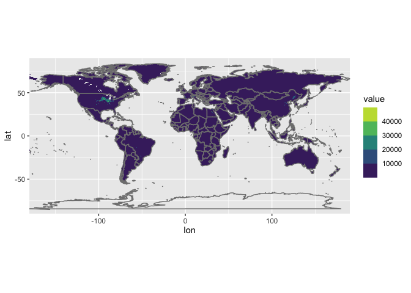
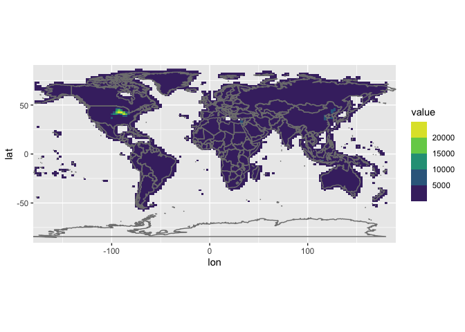

<!-- CURRICULUM_HEADER_START -->
<div class="mh"><p class="mh-crumb"><a href="/series/earth-data/index.html">Earth Data in Python and R</a><span class="sep">·</span>Part 3 · Regridding</p><p class="mh-facts"><span class="lvl lvl-intermediate">Intermediate</span></p><p class="mh-assumes">Assumes <span class="unwritten" title="not written yet">Conservative vs bilinear</span>.</p></div>
<!-- CURRICULUM_HEADER_END -->

::: {.callout-note appearance="simple" icon=false}
## TL;DR

A $5'\times 5'$ agricultural census and a $1.9^\circ\times 2.5^\circ$ Earth system model grid differ by a factor of about 675 in cell count, so the census must be regridded before the two can be combined. In R, `ncdf4` extracts the production layer, `raster::resample` interpolates it bilinearly onto the model mesh, and `ggplot2` shows both grids for a visual check. You also get the rule for when bilinear is acceptable and when a conservative scheme is required.
:::

```{mermaid}
flowchart LR
    NC["NetCDF Input<br/>maize_AreaYieldProduction.nc<br/>(4320 × 2160, 5' res)"] --> Ext["Extract production layer<br/>lon.old, lat.old, matrix"]
    Ext --> DF["Tidy Coordinate Array<br/>dimnames(matrix) → melt(df)"]
    DF --> R1["Source Raster Layer (r)<br/>rasterFromXYZ(old.df)"]
    R1 --> Res["Bilinear Resampling Engine<br/>t = resample(r, s, method='bilinear')"]
    Grid["Target Climate Grid (s)<br/>(144 × 96, 2.5° × 1.9°)"] --> Res
    Res --> Out["Regridded Dataframe<br/>as.matrix(t) → new.df"]
    Out --> Plot["Spatial Validation<br/>ggplot2 + geom_raster + borders()"]

    class NC indigo
    class Ext plum
    class DF sage
    class R1 ochre
    class Grid ochre
    class Res sienna
    class Out olive
    class Plot terracotta
    classDef indigo fill:#1d4a62,stroke:#c97d62,stroke-width:1.5px,color:#ffffff
    classDef sienna fill:#6c2b27,stroke:#c97d62,stroke-width:1.5px,color:#ffffff
    classDef plum fill:#48304a,stroke:#c97d62,stroke-width:1.5px,color:#ffffff
    classDef olive fill:#5b6e34,stroke:#c97d62,stroke-width:1.5px,color:#ffffff
    classDef ochre fill:#d69a2e,stroke:#3b1a18,stroke-width:1.5px,color:#3b1a18
    classDef terracotta fill:#c97d62,stroke:#3b1a18,stroke-width:1.5px,color:#3b1a18
    classDef sage fill:#95a87f,stroke:#3b1a18,stroke-width:1.5px,color:#3b1a18
```

## Resolution mismatch

Global atmospheric chemistry and climate models (e.g., CESM, GEOS-Chem) simulate biogeochemical cycles on coarse Eulerian grid meshes—typically $1.9^\circ \text{ latitude} \times 2.5^\circ \text{ longitude}$ (or $2^\circ \times 2.5^\circ$). Conversely, observational agricultural inventories and satellite-derived land-use datasets are archived at fine spatial scales ($5' \times 5'$, approximately $10\text{ km}\times 10\text{ km}$ at the equator).

Direct point sampling of fine datasets onto model grids introduces spatial aliasing and numerical artifacts. A systematic regridding pipeline must preserve spatial gradients and account for spherical coordinate boundaries.

| Attribute | Source Dataset (Agricultural Census) | Target Model Grid (CESM / GEOS-Chem) |
| :--- | :--- | :--- |
| **Spatial Resolution** | $5\text{ arc-minutes}$ ($1/12^\circ \approx 0.0833^\circ$) | $1.9^\circ\text{ lat} \times 2.5^\circ\text{ lon}$ ($f19\_f19$ configuration) |
| **Grid Dimensions** | $4320 \times 2160$ cells ($9.33 \times 10^6$ nodes) | $144 \times 96$ cells ($1.38 \times 10^4$ nodes) |
| **Data Reduction Factor** | $1.0\times$ (Raw resolution) | $\approx 675\times$ spatial compression |

### Bilinear spatial interpolation

For an arbitrary target grid center $(\lambda, \phi)$ bounded by four adjacent source nodes $Q_{11}=(\lambda_1, \phi_1)$, $Q_{12}=(\lambda_1, \phi_2)$, $Q_{21}=(\lambda_2, \phi_1)$, and $Q_{22}=(\lambda_2, \phi_2)$, bilinear interpolation computes the target value $f(\lambda, \phi)$ via two successive 1D linear interpolations:

$$f(\lambda, \phi) = \frac{1}{(\lambda_2 - \lambda_1)(\phi_2 - \phi_1)} \begin{bmatrix} \lambda_2 - \lambda & \lambda - \lambda_1 \end{bmatrix} \begin{bmatrix} f(Q_{11}) & f(Q_{12}) \\ f(Q_{21}) & f(Q_{22}) \end{bmatrix} \begin{bmatrix} \phi_2 - \phi \\ \phi - \phi_1 \end{bmatrix}$$

### Spherical cell area and mass diagnostics

When regridding extensive variables (such as total crop production in metric tons), total global mass must be conserved across transformations:

$$M_{\text{total}} = \sum_{i,j} \rho(\lambda_i, \phi_j) \cdot A(\lambda_i, \phi_j)$$

where the spherical surface area of grid cell $(\lambda_i, \phi_j)$ with angular bounds $[\lambda_w, \lambda_e]$ and $[\phi_s, \phi_n]$ is:

$$A(\lambda_i, \phi_j) = R_{\text{Earth}}^2 \cdot (\lambda_e - \lambda_w) \cdot (\sin\phi_n - \sin\phi_s)$$

## Regridding workflow

### Step 1: Environment setup and NetCDF ingestion

```r
library(ncdf4)      # NetCDF low-level interface
library(raster)     # Spatial raster manipulation & resampling
library(reshape2)   # Matrix to long-format dataframe conversion
library(tidyverse)  # Tidyverse data pipelines and ggplot2
```

```r
# Open the NetCDF handle and inspect dimensions
nc_name <- "maize_AreaYieldProduction.nc"
nc <- nc_open(filename = nc_name)

# Extract spatial coordinates and production matrix (layer 6 = production)
lon_source <- ncvar_get(nc = nc, varid = "longitude")
lat_source <- ncvar_get(nc = nc, varid = "latitude")
raw_matrix <- ncvar_get(nc = nc, varid = "maizeData")[, , 6]

nc_close(nc)
rm(nc)

# Assign explicit coordinate dimnames to prevent longitude inversion
dimnames(raw_matrix) <- list(lon = lon_source, lat = lat_source)
df_source <- melt(raw_matrix)

head(df_source, 4)
```

### Step 2: Source and target raster construction

```r
# Convert coordinate-value table into source raster
r_source <- rasterFromXYZ(df_source)

# Define target climate model resolution (CESM f19_f19: 1.9° lat x 2.5° lon)
dlat_target <- 1.9
nlat_target <- 96
dlon_target <- 2.5
nlon_target <- 144

# Instantiate empty target raster container
r_target <- raster(nrow = nlat_target, ncol = nlon_target)
```

### Step 3: Bilinear interpolation

```r
# Execute continuous bilinear spatial resampling
r_regridded <- resample(r_source, r_target, method = "bilinear")

# Convert resampled raster back to matrix with explicit coordinate sequences
matrix_regridded <- as.matrix(r_regridded)
dimnames(matrix_regridded) <- list(
  lat = seq(90, -90, length.out = nlat_target),
  lon = seq(-177.5, 180, by = dlon_target)
)

df_regridded <- melt(matrix_regridded)
```

### Step 4: Spatial distribution check

```r
# Plot high-resolution source dataset
plot_source <- df_source %>%
  ggplot(aes(x = lon, y = lat, fill = value)) +
  geom_raster(interpolate = FALSE) +
  scale_fill_viridis_b(na.value = NA, name = "Production") +
  borders(colour = "white", size = 0.2) +
  coord_equal(expand = FALSE) +
  theme_bw() +
  labs(title = "Source Data: High-Resolution Maize Production (5' x 5')", x = "Longitude", y = "Latitude")

plot_source
```



```r
# Plot regridded coarse model dataset
plot_regridded <- df_regridded %>%
  ggplot(aes(x = lon, y = lat, fill = value)) +
  geom_raster(interpolate = FALSE) +
  scale_fill_viridis_b(na.value = NA, name = "Production") +
  borders(colour = "white", size = 0.2) +
  coord_equal(expand = FALSE) +
  theme_bw() +
  labs(title = "Regridded Data: Climate Model Mesh (1.9° x 2.5°)", x = "Longitude", y = "Latitude")

plot_regridded
```



### Production R pipeline module

::: {.callout-note collapse="true"}
## View Modular Production Code (`regrid_netcdf_raster.R`)

```r
#' Spatial Regridding Module for Agricultural NetCDF Datasets
#'
#' @param nc_path Path to input NetCDF file.
#' @param var_name Variable identifier in NetCDF.
#' @param layer_idx Specific slice index for 3D/4D arrays.
#' @param target_res Numeric vector c(dlat, dlon) for target grid.
#' @return Dataframe with coordinates (lon, lat) and regridded values.
regrid_crop_data <- function(nc_path, var_name, layer_idx = 1, target_res = c(1.9, 2.5)) {
  if (!file.exists(nc_path)) {
    stop(paste("File not found:", nc_path))
  }

  nc_handle <- ncdf4::nc_open(nc_path)
  on.exit(ncdf4::nc_close(nc_handle), add = TRUE)

  lons <- ncdf4::ncvar_get(nc_handle, "longitude")
  lats <- ncdf4::ncvar_get(nc_handle, "latitude")
  data_array <- ncdf4::ncvar_get(nc_handle, var_name)

  if (length(dim(data_array)) == 3) {
    data_matrix <- data_array[, , layer_idx]
  } else {
    data_matrix <- data_array
  }

  dimnames(data_matrix) <- list(lon = lons, lat = lats)
  df_melted <- reshape2::melt(data_matrix)
  r_src <- raster::rasterFromXYZ(df_melted)

  nlat <- round(180 / target_res[1])
  nlon <- round(360 / target_res[2])
  r_tgt <- raster::raster(nrow = nlat, ncol = nlon)

  r_resampled <- raster::resample(r_src, r_tgt, method = "bilinear")
  resampled_mat <- as.matrix(r_resampled)

  dimnames(resampled_mat) <- list(
    lat = seq(90, -90, length.out = nlat),
    lon = seq(-180 + target_res[2] / 2, 180, by = target_res[2])
  )

  return(reshape2::melt(resampled_mat))
}
```
:::

### Data and code availability

- **Dependencies**: R $\ge 4.0.0$, `ncdf4`, `raster`, `reshape2`, `tidyverse`, `ggplot2`.
- **Dataset**: Global Crop Yield and Production NetCDF repository (Monfreda et al., University of Minnesota / McGill University).

## Resampling method tradeoffs

| Resampling Method | Algorithmic Mechanism | Mass Conservation | Recommended Use Case |
| :--- | :--- | :--- | :--- |
| **Nearest Neighbor** | Assigns nearest grid center value | Poor (discontinuous step jumps) | Discrete categorical fields (e.g. USDA plant functional types, soil taxonomy classes). |
| **Bilinear Interpolation** | Distance-weighted 4-node interpolation | Approximate (smoothing at boundaries) | Continuous physical variables (temperature, relative humidity, crop yield indices). |
| **First-Order Conservative** | Overlapping polygon area-weighted sum | Exact ($100\%$ mass conserved) | Extensive mass variables (total harvested production, nitrogen fertilizer mass, regional emissions). |

## Key takeaways

- A 5-arc-minute census grid has about 675 times as many cells as a $1.9^\circ \times 2.5^\circ$ model grid; regridding is a large reduction, not a relabelling.
- Once both rasters exist, `raster::resample(r, s, method = "bilinear")` interpolates a continuous field onto the target grid in one call; `rasterFromXYZ` builds the source raster from a melted (lon, lat, value) table.
- Assign `dimnames` before melting and rebuild explicit `lat` and `lon` sequences after resampling, otherwise the coordinates silently invert.
- Bilinear interpolation smooths intensive variables well but does not conserve mass; for totals such as production in tonnes, use a first-order conservative scheme or rescale to the original global sum.
- Plot source and target side by side on the same colour scale before trusting the output.

<!-- CURRICULUM_FOOTER_START -->
<div class="mf"><a class="mf-prev" href="/blogs/partial-scaling-netcdf/index.html"><span>Previous</span>Scaling a NetCDF subset</a><a class="mf-up" href="/series/earth-data/index.html"><span>Series</span>Earth Data in Python and R</a><a class="mf-next" href="/blogs/regional-analysis-r/index.html"><span>Next</span>Regional analysis in R</a></div>
<!-- CURRICULUM_FOOTER_END -->

