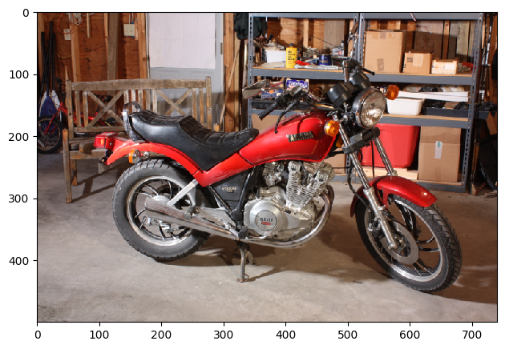
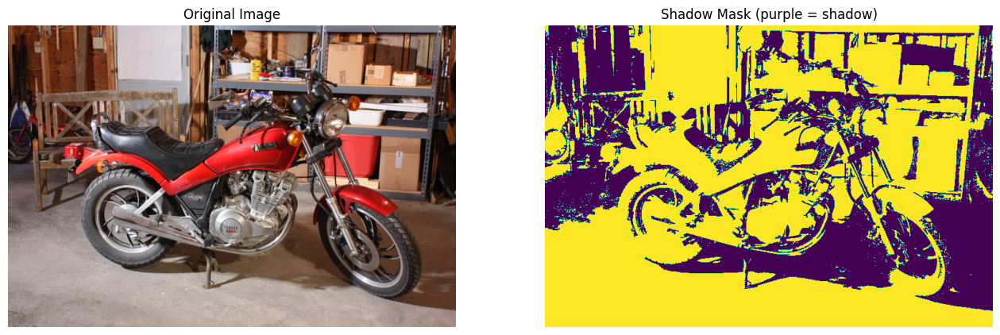

<!-- CURRICULUM_HEADER_START -->
<div class="mh"><p class="mh-crumb"><a href="/series/earth-data/index.html">Earth Data in Python and R</a><span class="sep">·</span>Part 9 · Images and rasters</p><p class="mh-facts"><span class="lvl lvl-intermediate">Intermediate</span></p><p class="mh-assumes">Some programming in any language.</p></div>
<!-- CURRICULUM_HEADER_END -->

::: {.callout-note appearance="simple" icon=false}
## TL;DR

A cast shadow scales R, G and B by the same factor, so an intensity threshold cannot tell a shadowed bright surface from a lit dark one. Converting to HSV separates brightness ($V$) from colour ($H$); Otsu thresholds on each, combined and cleaned with a 500-pixel area opening, give a shadow mask in a dozen lines of `scikit-image`. The failure-mode table at the end says when the global method breaks outdoors.
:::

```{mermaid}
flowchart LR
    RGB["Input RGB Image<br/>(H × W × 3)"] --> HSV["Nonlinear Transform<br/>RGB → HSV Space"]
    HSV --> Split["Channel Decoupling<br/>Value (V) & Hue (H)"]
    Split --> OtsuV["Otsu Thresholding<br/>on Luminance: V < t_v"]
    Split --> OtsuH["Otsu Thresholding<br/>on Chromaticity: H < t_h"]
    OtsuV & OtsuH --> Conj["Logical Conjunction<br/>M_raw = (V < t_v) ∧ (H < t_h)"]
    Conj --> Morph["Morphological Opening<br/>Area Filter: min_size = 500 px"]
    Morph --> Out["Binary Shadow Mask<br/>(H × W)"]

    class RGB indigo
    class HSV plum
    class Split sage
    class OtsuV ochre
    class OtsuH ochre
    class Conj sienna
    class Morph olive
    class Out terracotta
    classDef indigo fill:#1d4a62,stroke:#c97d62,stroke-width:1.5px,color:#ffffff
    classDef sienna fill:#6c2b27,stroke:#c97d62,stroke-width:1.5px,color:#ffffff
    classDef plum fill:#48304a,stroke:#c97d62,stroke-width:1.5px,color:#ffffff
    classDef olive fill:#5b6e34,stroke:#c97d62,stroke-width:1.5px,color:#ffffff
    classDef ochre fill:#d69a2e,stroke:#3b1a18,stroke-width:1.5px,color:#3b1a18
    classDef terracotta fill:#c97d62,stroke:#3b1a18,stroke-width:1.5px,color:#3b1a18
    classDef sage fill:#95a87f,stroke:#3b1a18,stroke-width:1.5px,color:#3b1a18
```

## Why RGB thresholds fail

In standard Red-Green-Blue (RGB) color space, an incident shadow causes a scalar attenuation of the illumination field across all three spectral bands:

$$I_{\text{shadow}}(x, y) = k(x, y) \cdot I_{\text{lit}}(x, y), \quad 0 < k(x, y) < 1$$

Because $k(x, y)$ reduces $R$, $G$, and $B$ intensities simultaneously, scalar thresholding in RGB space cannot distinguish between an intrinsically dark surface (low albedo under full sunlight) and a bright surface covered by a cast shadow.

To resolve this ambiguity, we project the RGB representation into a cylindrical coordinate system: **Hue, Saturation, and Value (HSV)**.

| Channel | Coordinate Range | Physical Property Encoded | Invariance under Cast Shadows |
| :--- | :--- | :--- | :--- |
| **Hue ($H$)** | $[0, 1]$ or $[0^\circ, 360^\circ)$ | Dominant spectral wavelength (perceived color tone) | High (preserved under uniform spectral attenuation) |
| **Saturation ($S$)** | $[0, 1]$ | Chromatic purity / spectral bandwidth | Moderate (slight shift due to ambient skylight scatter) |
| **Value ($V$)** | $[0, 1]$ | Maximum spectral intensity (achromatic luminance) | Low (primary channel attenuated by shadow occlusion) |

### Nonlinear RGB to HSV projection

For a normalized pixel vector $(R, G, B) \in [0, 1]^3$, let $M = \max(R, G, B)$, $m = \min(R, G, B)$, and $\Delta = M - m$:

$$V = M$$

$$S = \begin{cases} 0 & \text{if } M = 0 \\ \frac{\Delta}{M} & \text{if } M > 0 \end{cases}$$

$$H = \begin{cases} 0^\circ & \text{if } \Delta = 0 \\ 60^\circ \times \left( \frac{G - B}{\Delta} \bmod 6 \right) & \text{if } M = R \\ 60^\circ \times \left( \frac{B - R}{\Delta} + 2 \right) & \text{if } M = G \\ 60^\circ \times \left( \frac{R - G}{\Delta} + 4 \right) & \text{if } M = B \end{cases}$$

Cast shadow regions exhibit low Value ($V$) combined with consistent or restricted Hue ($H$) distributions.

### Otsu bimodal variance optimisation

Rather than manually setting empirical thresholds, we compute optimal separation thresholds $t^*$ using **Otsu's method**. Otsu maximizes the inter-class variance $\sigma_b^2(t)$ between foreground and background pixels:

$$\sigma_b^2(t) = \omega_0(t) \omega_1(t) \left[ \mu_0(t) - \mu_1(t) \right]^2$$

where $\omega_0(t)$ and $\omega_1(t)$ represent class probabilities below and above threshold $t$, and $\mu_0(t), \mu_1(t)$ are the respective class means. The optimal threshold is:

$$t^* = \arg\max_{t} \sigma_b^2(t)$$

We evaluate $t_v^*$ on the Value plane $V(x, y)$ and $t_h^*$ on the Hue plane $H(x, y)$.

### Morphological noise filtering

The initial conjunction mask:

$$M_{\text{raw}}(x, y) = \mathbb{I}\left( V(x, y) < t_v^* \right) \land \mathbb{I}\left( H(x, y) < t_h^* \right)$$

contains high-frequency spatial noise from surface texture. We apply morphological area opening $\gamma_\lambda$ with minimum connected-component area $\lambda = 500\text{ pixels}$:

$$M_{\text{clean}} = \gamma_\lambda(M_{\text{raw}}) = \bigcup \{ C_i \subseteq M_{\text{raw}} \mid \text{Area}(C_i) \ge \lambda \}$$

## Implementation workflow

### Step 1: Input and environment setup

```python
import numpy as np
import matplotlib.pyplot as plt
from skimage import color, data, filters, morphology
```

```python
image_rgb = data.stereo_motorcycle()[0]

fig, ax = plt.subplots(figsize=(8, 5))
ax.imshow(image_rgb)
ax.set_title("Input Scene (RGB)", fontsize=11)
ax.axis("off")
plt.tight_layout()
plt.show()
```



### Step 2: HSV transform and channel splitting

```python
# Convert to normalized float HSV representation
image_hsv = color.rgb2hsv(image_rgb)

hue_channel = image_hsv[:, :, 0]
value_channel = image_hsv[:, :, 2]
```

### Step 3: Threshold computation

```python
thresh_value = filters.threshold_otsu(value_channel)
thresh_hue = filters.threshold_otsu(hue_channel)

print(f"Otsu Value Threshold (Luminance): {thresh_value:.4f}")
print(f"Otsu Hue Threshold (Chromaticity): {thresh_hue:.4f}")
```

### Step 4: Binary conjunction and morphological opening

```python
# Conjunction of luminance attenuation and hue bounds
raw_mask = (value_channel < thresh_value) & (hue_channel < thresh_hue)

# Remove isolated false-positive clusters
clean_mask = morphology.remove_small_objects(raw_mask, min_size=500)
```

### Step 5: Segmentation check

```python
fig, axes = plt.subplots(1, 2, figsize=(14, 6))

axes[0].imshow(image_rgb)
axes[0].set_title("Original RGB Scene", fontsize=12)
axes[0].axis("off")

axes[1].imshow(clean_mask, cmap="viridis")
axes[1].set_title("Detected Shadow Mask (Morphological Cleaned)", fontsize=12)
axes[1].axis("off")

plt.tight_layout()
plt.show()
```



### Production Python module

::: {.callout-note collapse="true"}
## View Modular Production Code (`ShadowSegmenter` Class)

```python
from dataclasses import dataclass
from typing import Tuple
import numpy as np
from skimage import color, filters, morphology


@dataclass(frozen=True)
class ShadowSegmentationResult:
    raw_mask: np.ndarray
    clean_mask: np.ndarray
    thresh_value: float
    thresh_hue: float


class ShadowSegmenter:
    """Automated shadow detection pipeline using HSV decoupling and Otsu thresholding."""

    def __init__(self, min_area_pixels: int = 500):
        self.min_area_pixels = min_area_pixels

    def fit_predict(self, rgb_image: np.ndarray) -> ShadowSegmentationResult:
        """Execute shadow segmentation pipeline on a normalized or uint8 RGB image.

        Parameters
        ----------
        rgb_image : np.ndarray
            Input RGB image with shape (H, W, 3).

        Returns
        -------
        ShadowSegmentationResult
            Data container with raw mask, cleaned mask, and computed thresholds.
        """
        if rgb_image.ndim != 3 or rgb_image.shape[2] != 3:
            raise ValueError(
                f"Expected 3-channel RGB image, got shape {rgb_image.shape}"
            )

        # 1. Project into HSV space
        hsv_image = color.rgb2hsv(rgb_image)
        hue = hsv_image[:, :, 0]
        val = hsv_image[:, :, 2]

        # 2. Derive bimodal separation thresholds
        t_val = float(filters.threshold_otsu(val))
        t_hue = float(filters.threshold_otsu(hue))

        # 3. Form conjunction mask
        raw_mask = (val < t_val) & (hue < t_hue)

        # 4. Filter high-frequency noise
        clean_mask = morphology.remove_small_objects(
            raw_mask, min_size=self.min_area_pixels
        )

        return ShadowSegmentationResult(
            raw_mask=raw_mask,
            clean_mask=clean_mask,
            thresh_value=t_val,
            thresh_hue=t_hue,
        )
```
:::

### Data and code availability

- **Dependencies**: Python $\ge 3.10$, `numpy`, `scikit-image`, `matplotlib`.
- **Sample Dataset**: Built-in `scikit-image` standard evaluation scenes (`skimage.data.stereo_motorcycle`).

## Failure modes and edge cases

| Failure Mode | Physical / Algorithmic Mechanism | Production Mitigation |
| :--- | :--- | :--- |
| **Rayleigh Skylight Scattering** | Outdoor ambient skylight introduces blue shifts into shadow regions ($H$ shifts toward $210^\circ - 240^\circ$). | Apply adaptive band-pass filtering on Hue ($H_{\text{min}} \le H \le H_{\text{max}}$) rather than a simple upper bound. |
| **Low-Albedo Surfaces** | Black asphalt or dark fabrics have naturally low $V$ without being shadowed. | Incorporate edge-contrast verification across boundary gradients $\nabla I(x, y)$. |
| **Non-Uniform Ambient Lighting** | Vignetting and wide-angle illuminance falloff degrade global Otsu effectiveness. | Replace global Otsu with local adaptive window thresholding (`skimage.filters.threshold_local`). |

## Key takeaways

- A cast shadow multiplies R, G and B by the same factor, so no RGB threshold separates a shadowed bright surface from a lit dark one.
- HSV puts brightness in $V$ and colour in $H$; shadows lower $V$ and leave $H$ roughly unchanged.
- Otsu's method picks the threshold that maximises between-class variance, which removes the need for a hand-tuned cutoff on each channel.
- Combining the $V$ and $H$ masks and removing components under 500 pixels with `morphology.remove_small_objects` clears texture noise.
- Blue skylight in shadows, dark surfaces and uneven illumination each defeat the global method; band-pass the hue, check edge contrast or switch to `threshold_local`.

<!-- CURRICULUM_FOOTER_START -->
<div class="mf"><a class="mf-prev" href="/blogs/parsing-special-symbols/index.html"><span>Previous</span>Special symbols in labels</a><a class="mf-up" href="/series/earth-data/index.html"><span>Series</span>Earth Data in Python and R</a></div>
<!-- CURRICULUM_FOOTER_END -->

