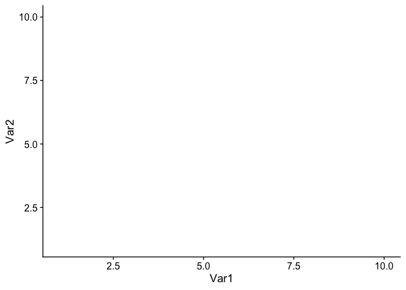
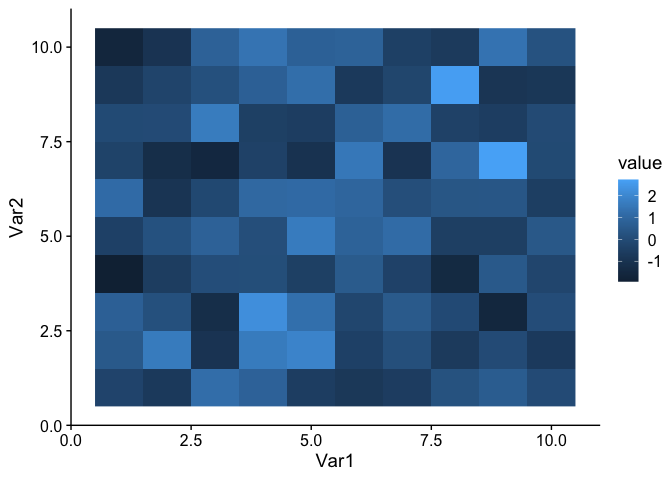
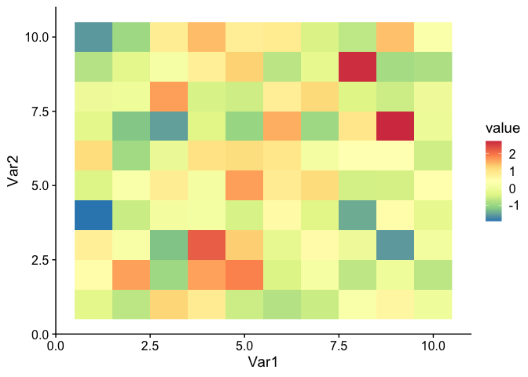
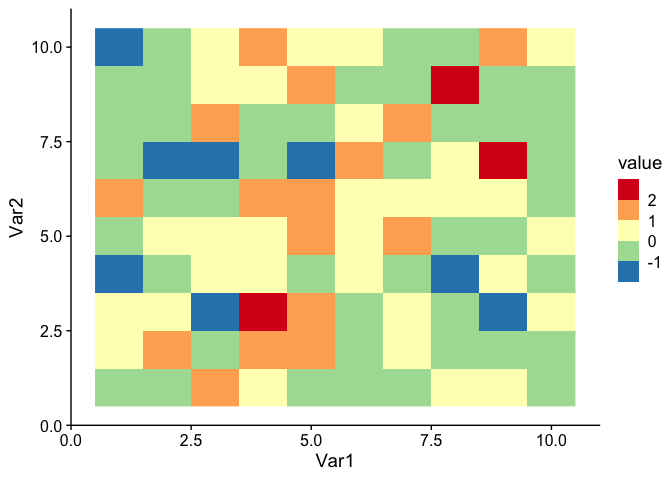
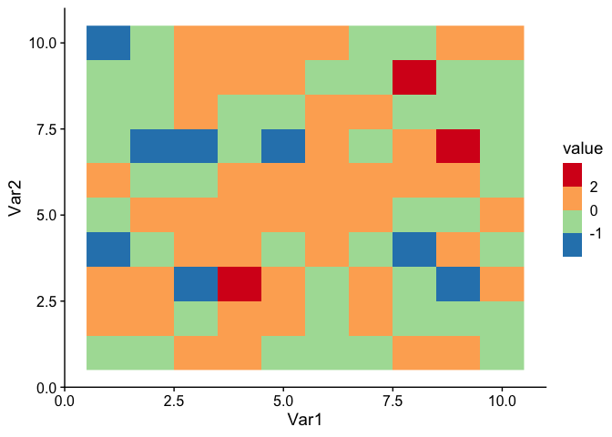
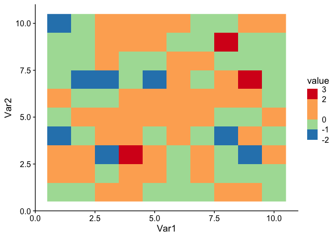

<!-- CURRICULUM_HEADER_START -->
<div class="mh"><p class="mh-crumb"><a href="/series/earth-data/index.html">Earth Data in Python and R</a><span class="sep">·</span>Part 7 · ggplot2</p><p class="mh-facts"><span class="lvl lvl-introductory">Introductory</span></p><p class="mh-assumes">Some programming in any language.</p></div>
<!-- CURRICULUM_HEADER_END -->

::: {.callout-note appearance="simple" icon=false}
## TL;DR

The default ggplot2 colorbar is continuous, unbinned and clipped to the data range, which rarely matches what a figure needs to say. This module walks from `geom_raster` through `scale_fill_distiller`, `scale_fill_fermenter`, custom `breaks`, uneven steps with `guide_coloursteps`, and fixed `limits` with `oob = squish` so out-of-range cells are pinned rather than dropped. Each step is one added layer.
:::

## Sample data

Start with a 10-by-10 matrix of random numbers, melted into the long data frame ggplot2 expects.

```r
# create a 10-by-10 matrix with random numbers as entries
m = matrix(data = rnorm(n = 100), nrow = 10, ncol = 10)

# converting the matrix into a data frame for ggplot to read
library(reshape2)
df = melt(m)

# showing the first 7 rows of the data frame for illustration
head(x = df, n = 7)
```

    ##   Var1 Var2      value
    ## 1    1    1 -0.2921716
    ## 2    2    1 -0.6998522
    ## 3    3    1  1.2001914
    ## 4    4    1  0.8193078
    ## 5    5    1 -0.5572283
    ## 6    6    1 -0.7793558
    ## 7    7    1 -0.5819304

## Continuous and binned palettes

The base plot carries the axes and theme; each variant below adds one scale. The scale is what decides how a value becomes a colour, so the colorbar is entirely a property of the `scale_fill_*` layer you attach. Three families cover most figures: `scale_fill_gradient` and `scale_fill_gradient2` build a ramp from two or three colours you name, `scale_fill_distiller` interpolates a ColorBrewer palette continuously, and `scale_fill_fermenter` uses the same palettes but in discrete bins. For anomalies, use a diverging palette with `scale_fill_gradient2(midpoint = 0)` or a diverging ColorBrewer palette such as `"RdBu"` with symmetric limits, so that zero sits on the neutral colour and equal magnitudes on either side get equal visual weight.

```r
library(ggplot2)  # for plotting
library(cowplot)  # for publication friendly ggplot themes

# setting up the base plot
g = ggplot(data = df, mapping = aes(x = Var1, y = Var2)) + theme_cowplot()

g
```



Let's show our data on the plot as a heatmap, with colors depending on the "value".

```r
# adding "heatmap" using rastered grids
g1 = g + geom_raster(mapping = aes(fill = value)) # for raster plot, "fill" defines the color inside each rectangle
g1
```



Gridboxes with lower values are filled with darker blue, and vice versa. Some prefer a different palette.

```r
# adding raster but with better colors
g2 = g1 + scale_fill_distiller(palette = "Spectral")
g2
```



Some prefer binned colors.

```r
# adding raster but with binned colors
g2.binned = g1 + scale_fill_fermenter(palette = "Spectral")
g2.binned
```



## Custom breaks and limits

Bins need not be even. `breaks` sets the edges, and the choice of edges is a scientific decision rather than a cosmetic one: a threshold that matters physically, such as a regulatory limit or the freezing point, should be a bin edge so the map answers the question at a glance.

```r
# adding raster but with binned colors and customized breaks
g3 = g1 + scale_fill_fermenter(palette = "Spectral", breaks = c(-1, 0, 2))
g3
```



Some even prefer non-uniform scales.

```r
# adding raster but with binned colors and customized breaks on a non-uniform scale
g4 = g1 + scale_fill_fermenter(palette = "Spectral", breaks = c(-1, 0, 2)) + guides (fill = guide_coloursteps(even.steps = F))
g4
```


Finally, for some who want to control the limits or ends of the
colorbar. One thing to note: after setting the limit range for the
colorbar, some gridboxes may have out-of-bound (oob) values and to be treated as "NA". This can be simply avoided by using the "squish" function under package "scales". The default `oob` handler is `censor`, which turns anything outside `limits` into `NA` and draws it in the `na.value` colour, grey by default. `squish` pins those values to the nearest limit instead, so a cell at 4.2 with an upper limit of 3 is drawn in the top colour rather than dropped. `show.limits = TRUE` prints the limit values at the ends of the bar, which tells the reader where the clipping starts. Fixed limits also make panels comparable: two maps drawn with the same `limits` share a colorbar in meaning even if they are drawn separately.

```r
# adding raster with binned colors and customerized breaks on a non-uniform scale, and control the limits
library(scales)   # for the "squish" function
g5 = g1 + scale_fill_fermenter(palette = "Spectral", breaks = c(-1, 0, 2), limits = c(-2, 3), oob = squish) + guides (fill = guide_coloursteps(even.steps = F, show.limits = T))
g5
```



## Key takeaways

- `geom_raster(aes(fill = value))` gives a heatmap; the colorbar is whatever `scale_fill_*` you attach.
- `scale_fill_distiller(palette = ...)` gives a continuous ColorBrewer ramp; `scale_fill_fermenter` gives the same palette in bins.
- `breaks` sets the bin edges; `guide_coloursteps(even.steps = FALSE)` draws the bins at their true widths instead of equal ones.
- `limits` clips the scale, and values outside it become `NA` unless you pass `oob = scales::squish`, which pins them to the nearest limit.
- `show.limits = TRUE` prints the end values on the bar so the reader knows where clipping starts.

<!-- CURRICULUM_FOOTER_START -->
<div class="mf"><a class="mf-prev" href="/blogs/barchart-with-labels/index.html"><span>Previous</span>Direct labels on bar charts</a><a class="mf-up" href="/series/earth-data/index.html"><span>Series</span>Earth Data in Python and R</a><a class="mf-next" href="/blogs/parsing-special-symbols/index.html"><span>Next</span>Special symbols in labels</a></div>
<!-- CURRICULUM_FOOTER_END -->

